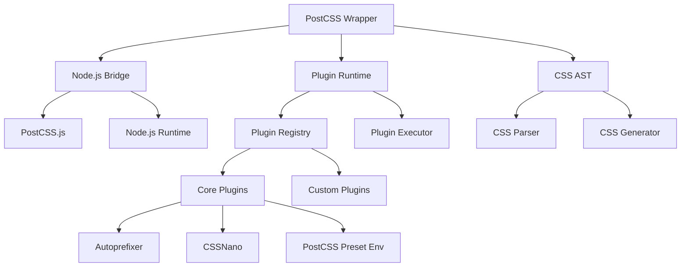

# PostCSS Full Implementation Design Documents

This directory contains comprehensive design documents for implementing full PostCSS functionality in `tailwind-rs-postcss`, transforming it from a framework into a production-ready CSS processing tool.

## Design Documents Overview

### 1. [PostCSS Full Implementation Plan](postcss-full-implementation-plan.md)
**Purpose**: High-level strategy for transforming `tailwind-rs-postcss` into a fully functional PostCSS implementation.

**Key Topics**:
- Current state analysis
- Implementation phases (8 weeks)
- Technical architecture
- Success metrics
- Risk mitigation

**Target Audience**: Project managers, technical leads, stakeholders

### 2. [Node.js Integration Architecture](node-js-integration-architecture.md)
**Purpose**: Detailed technical architecture for integrating Node.js and PostCSS.js into Rust.

**Key Topics**:
- N-API integration strategies
- Node.js runtime management
- Plugin system integration
- CSS AST conversion
- Error handling and recovery

**Target Audience**: Senior developers, system architects

### 3. [Plugin Ecosystem Implementation](plugin-ecosystem-implementation.md)
**Purpose**: Comprehensive plan for building a full-featured plugin ecosystem.

**Key Topics**:
- Core plugin interface
- Plugin registry and management
- Core plugin implementations (Autoprefixer, CSSNano, PostCSS Preset Env)
- Advanced plugin features
- Plugin testing framework

**Target Audience**: Plugin developers, framework developers

### 4. [CSS AST Implementation](css-ast-implementation.md)
**Purpose**: Detailed implementation of CSS Abstract Syntax Tree for real CSS processing.

**Key Topics**:
- AST node types and structure
- CSS tokenizer implementation
- CSS parser implementation
- AST manipulation and traversal
- CSS generation and stringification

**Target Audience**: Core developers, parser experts

### 5. [Performance Optimization Strategy](performance-optimization-strategy.md)
**Purpose**: Comprehensive performance optimization for production workloads.

**Key Topics**:
- Memory management and object pooling
- Multi-level caching system
- Parallel processing and work stealing
- Streaming CSS processing
- Performance monitoring and benchmarking

**Target Audience**: Performance engineers, production developers

### 6. [Implementation Roadmap](implementation-roadmap.md)
**Purpose**: Detailed project roadmap with timelines, milestones, and resource requirements.

**Key Topics**:
- 16-week implementation timeline
- Technical milestones and success criteria
- Risk mitigation strategies
- Resource requirements and budget
- Next steps and immediate actions

**Target Audience**: Project managers, development teams, stakeholders

## Implementation Priority

### Phase 1: Foundation (Weeks 1-4)
1. **Node.js Integration** - Essential for PostCSS.js integration
2. **CSS AST Implementation** - Required for CSS manipulation
3. **Basic CSS Processing** - Core functionality

### Phase 2: Plugin System (Weeks 5-8)
1. **Plugin Runtime** - Execute plugins on CSS
2. **Core Plugins** - Autoprefixer, CSSNano, PostCSS Preset Env
3. **Plugin Configuration** - Advanced plugin management

### Phase 3: Performance (Weeks 9-12)
1. **Caching System** - Multi-level caching for performance
2. **Parallel Processing** - Concurrent CSS processing
3. **Memory Optimization** - Production-ready memory management

### Phase 4: Production (Weeks 13-16)
1. **Testing & QA** - Comprehensive testing suite
2. **Documentation** - Complete user and developer documentation
3. **Deployment** - Production-ready deployment

## Success Metrics

### Functional Requirements
- ✅ Process real CSS files with PostCSS plugins
- ✅ Support all major PostCSS plugins
- ✅ Generate source maps
- ✅ Handle complex CSS transformations
- ✅ Maintain PostCSS.js compatibility

### Performance Requirements
- ✅ Process 1MB CSS in < 5 seconds
- ✅ Support concurrent processing
- ✅ Memory usage < 100MB for typical workloads
- ✅ Startup time < 2 seconds
- ✅ Cache hit rate > 90%

### Quality Requirements
- ✅ 100% test coverage for core functionality
- ✅ Comprehensive error handling
- ✅ Full documentation
- ✅ Performance benchmarks
- ✅ Memory leak detection

## Technical Architecture Overview

## Getting Started

### For Project Managers
1. Read [Implementation Roadmap](implementation-roadmap.md) for project overview
2. Review [PostCSS Full Implementation Plan](postcss-full-implementation-plan.md) for strategy
3. Use resource requirements and timeline for planning

### For Developers
1. Start with [Node.js Integration Architecture](node-js-integration-architecture.md)
2. Review [CSS AST Implementation](css-ast-implementation.md) for core functionality
3. Study [Plugin Ecosystem Implementation](plugin-ecosystem-implementation.md) for plugin development

### For Performance Engineers
1. Focus on [Performance Optimization Strategy](performance-optimization-strategy.md)
2. Review caching and parallel processing sections
3. Implement benchmarking and monitoring

## Contributing

When contributing to the implementation:

1. **Follow the roadmap** - Implement features in the order specified
2. **Meet success criteria** - Ensure all metrics are met
3. **Write comprehensive tests** - Maintain 100% test coverage
4. **Document everything** - Update documentation as you go
5. **Performance first** - Optimize for production workloads

## Questions and Support

For questions about the implementation:

1. **Technical questions** - Review relevant design documents
2. **Architecture questions** - Check Node.js Integration Architecture
3. **Performance questions** - See Performance Optimization Strategy
4. **Project questions** - Refer to Implementation Roadmap

This comprehensive design provides everything needed to transform `tailwind-rs-postcss` into a fully functional, production-ready PostCSS implementation.
