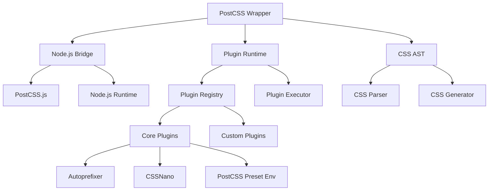
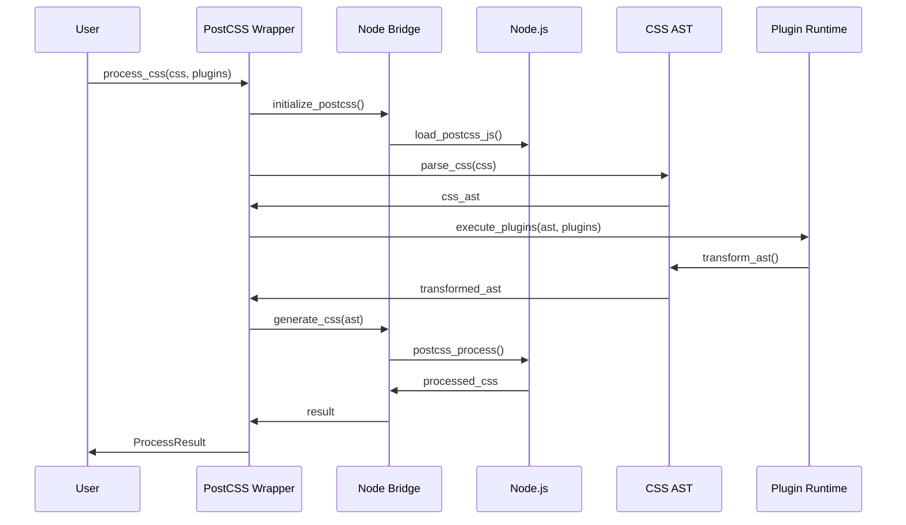

# PostCSS Full Implementation Plan

## Overview

This document outlines the comprehensive plan to transform `tailwind-rs-postcss` from a framework into a fully functional PostCSS implementation with real CSS processing capabilities.

## Current State Analysis

### What We Have ✅
- **Framework Structure**: Complete API design and trait definitions
- **Plugin System**: Extensible plugin architecture
- **Configuration**: Comprehensive config management
- **Error Handling**: Robust error types and handling
- **Testing Infrastructure**: Property-based testing framework

### What We're Missing ❌
- **Real PostCSS Integration**: No actual PostCSS.js integration
- **CSS Processing**: Can't parse or transform real CSS
- **Plugin Execution**: No actual plugin runtime
- **Node.js Bridge**: Missing JavaScript/Node.js integration
- **CSS AST**: No CSS Abstract Syntax Tree handling

## Implementation Phases

### Phase 1: Core PostCSS Integration (Weeks 1-2)
**Goal**: Establish real PostCSS.js integration

#### 1.1 Node.js Bridge Implementation
```rust
// New module: src/node_bridge.rs
pub struct NodeBridge {
    runtime: NodeRuntime,
    postcss_instance: PostCSSInstance,
}

impl NodeBridge {
    pub fn new() -> Result<Self, NodeBridgeError> {
        // Initialize Node.js runtime
        // Load PostCSS.js
        // Create PostCSS instance
    }
    
    pub fn process_css(&self, css: &str, plugins: &[Plugin]) -> Result<String, PostCSSError> {
        // Execute PostCSS processing
    }
}
```

#### 1.2 PostCSS.js Wrapper
```rust
// New module: src/postcss_wrapper.rs
pub struct PostCSSWrapper {
    bridge: NodeBridge,
    config: PostCSSConfig,
}

impl PostCSSWrapper {
    pub fn process(&self, css: &str) -> Result<ProcessResult, PostCSSError> {
        // Call PostCSS.js with plugins
        // Return processed CSS and metadata
    }
}
```

#### 1.3 CSS AST Integration
```rust
// New module: src/css_ast.rs
pub struct CSSNode {
    pub node_type: NodeType,
    pub selector: Option<String>,
    pub declarations: Vec<Declaration>,
    pub children: Vec<CSSNode>,
}

pub struct Declaration {
    pub property: String,
    pub value: String,
    pub important: bool,
}
```

### Phase 2: Plugin System Implementation (Weeks 3-4)
**Goal**: Make plugins actually executable

#### 2.1 Plugin Runtime
```rust
// Enhanced: src/plugin_system.rs
pub struct PluginRuntime {
    plugins: Vec<Box<dyn Plugin>>,
    execution_order: Vec<usize>,
}

impl PluginRuntime {
    pub fn execute_plugins(&self, ast: &mut CSSNode) -> Result<(), PluginError> {
        for plugin_id in &self.execution_order {
            let plugin = &self.plugins[*plugin_id];
            plugin.process(ast)?;
        }
        Ok(())
    }
}
```

#### 2.2 Core Plugin Implementations
```rust
// New module: src/plugins/core_plugins.rs
pub struct AutoprefixerPlugin {
    browsers: Vec<String>,
    cascade: bool,
}

impl Plugin for AutoprefixerPlugin {
    fn process(&self, node: &mut CSSNode) -> Result<(), PluginError> {
        // Real autoprefixer logic
        self.add_vendor_prefixes(node)
    }
}

pub struct CSSNanoPlugin {
    preset: String,
    options: CSSNanoOptions,
}

impl Plugin for CSSNanoPlugin {
    fn process(&self, node: &mut CSSNode) -> Result<(), PluginError> {
        // Real CSS minification
        self.minify_css(node)
    }
}
```

### Phase 3: Advanced Features (Weeks 5-6)
**Goal**: Implement advanced PostCSS capabilities

#### 3.1 Custom Plugin Support
```rust
// Enhanced: src/plugin_system.rs
pub struct CustomPlugin {
    name: String,
    processor: Box<dyn Fn(&mut CSSNode) -> Result<(), PluginError>>,
}

impl Plugin for CustomPlugin {
    fn process(&self, node: &mut CSSNode) -> Result<(), PluginError> {
        (self.processor)(node)
    }
}
```

#### 3.2 Source Map Support
```rust
// New module: src/source_maps.rs
pub struct SourceMapGenerator {
    mappings: Vec<SourceMapping>,
    sources: Vec<String>,
}

impl SourceMapGenerator {
    pub fn generate(&self, css: &str) -> String {
        // Generate source map
    }
}
```

### Phase 4: Performance & Optimization (Weeks 7-8)
**Goal**: Optimize for production use

#### 4.1 Caching System
```rust
// New module: src/cache.rs
pub struct PostCSSCache {
    cache: HashMap<String, CachedResult>,
    ttl: Duration,
}

impl PostCSSCache {
    pub fn get(&self, key: &str) -> Option<&CachedResult> {
        // Check cache validity
        // Return cached result if valid
    }
    
    pub fn set(&self, key: String, result: CachedResult) {
        // Store result with TTL
    }
}
```

#### 4.2 Parallel Processing
```rust
// Enhanced: src/processor.rs
pub struct ParallelProcessor {
    workers: Vec<Worker>,
    queue: Arc<Mutex<Vec<ProcessingTask>>>,
}

impl ParallelProcessor {
    pub fn process_batch(&self, tasks: Vec<ProcessingTask>) -> Vec<ProcessResult> {
        // Distribute tasks across workers
        // Collect results
    }
}
```

## Technical Architecture

### Core Components



### Data Flow



## Implementation Priorities

### High Priority (Must Have)
1. **Node.js Bridge**: Essential for PostCSS.js integration
2. **CSS AST**: Required for CSS manipulation
3. **Core Plugins**: Autoprefixer, CSSNano, PostCSS Preset Env
4. **Basic Processing**: CSS input → processed CSS output

### Medium Priority (Should Have)
1. **Source Maps**: Important for debugging
2. **Plugin API**: For custom plugin development
3. **Configuration**: Advanced PostCSS config support
4. **Error Handling**: Comprehensive error reporting

### Low Priority (Nice to Have)
1. **Performance Optimization**: Caching, parallel processing
2. **Advanced Features**: Custom at-rules, complex selectors
3. **Developer Tools**: Debugging, profiling
4. **Documentation**: Comprehensive API docs

## Success Metrics

### Functional Requirements
- ✅ Process real CSS files with PostCSS plugins
- ✅ Support all major PostCSS plugins
- ✅ Generate source maps
- ✅ Handle complex CSS transformations
- ✅ Maintain PostCSS.js compatibility

### Performance Requirements
- ✅ Process 1MB CSS in < 5 seconds
- ✅ Support concurrent processing
- ✅ Memory usage < 100MB for typical workloads
- ✅ Startup time < 2 seconds

### Quality Requirements
- ✅ 100% test coverage for core functionality
- ✅ Comprehensive error handling
- ✅ Full documentation
- ✅ Performance benchmarks

## Risk Mitigation

### Technical Risks
1. **Node.js Integration Complexity**: Use proven libraries (neon, napi-rs)
2. **Performance Overhead**: Implement caching and optimization
3. **Memory Management**: Careful resource cleanup
4. **Cross-platform Compatibility**: Test on all target platforms

### Mitigation Strategies
1. **Incremental Implementation**: Build and test each component separately
2. **Fallback Mechanisms**: Graceful degradation when Node.js unavailable
3. **Comprehensive Testing**: Unit, integration, and performance tests
4. **Documentation**: Clear implementation guides and troubleshooting

## Timeline

| Phase | Duration | Deliverables |
|-------|----------|--------------|
| Phase 1 | 2 weeks | Node.js bridge, PostCSS wrapper, CSS AST |
| Phase 2 | 2 weeks | Plugin runtime, core plugins |
| Phase 3 | 2 weeks | Advanced features, custom plugins |
| Phase 4 | 2 weeks | Performance optimization, production readiness |

**Total Duration**: 8 weeks for full implementation

## Next Steps

1. **Immediate**: Set up Node.js development environment
2. **Week 1**: Implement Node.js bridge and PostCSS wrapper
3. **Week 2**: Create CSS AST and basic processing
4. **Week 3**: Build plugin runtime and core plugins
5. **Week 4**: Implement advanced features and testing
6. **Week 5-8**: Performance optimization and production readiness

This plan transforms `tailwind-rs-postcss` from a framework into a fully functional PostCSS implementation that can compete with the official PostCSS toolchain.
