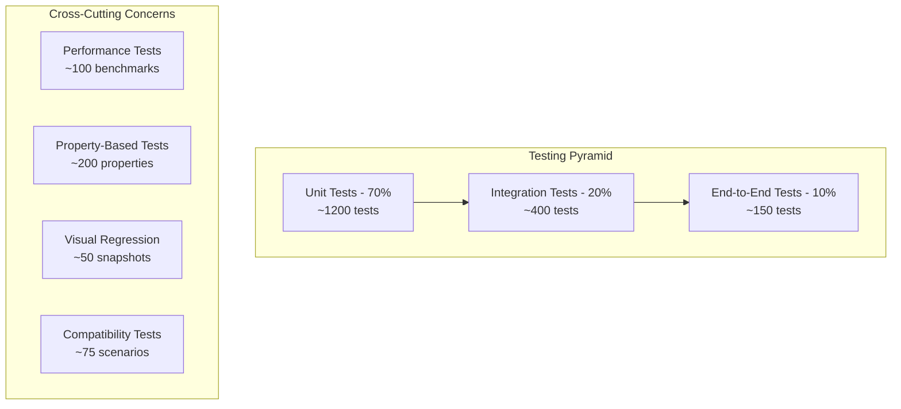

# Tailwind-RS v2.0 Testing Strategy & Framework

## Overview

This document outlines the comprehensive testing strategy for Tailwind-RS v2.0, building upon the solid foundation of v0.9.1 (593 passing tests) to ensure reliability, performance, and compatibility throughout the enhanced feature set.

## Current Testing Foundation (v0.9.1)

**Existing Test Suite:**
- ✅ 593/593 tests passing (100% success rate)
- ✅ Property-based testing with proptest
- ✅ Integration tests across all crates
- ✅ Performance regression testing
- ✅ WASM compatibility testing

**Test Structure:**
```
crates/tailwind-rs-core/tests/
├── integration_tests.rs
├── property_tests.rs
├── performance_tests.rs
└── wasm_tests.rs

crates/tailwind-rs-testing/src/
├── lib.rs
├── test_utilities.rs
└── property_generators.rs
```

## Enhanced Testing Strategy (v2.0)

### Testing Pyramid



### Test Categories

#### 1. Unit Tests (70% - ~1,200 tests)
**Scope:** Individual functions, modules, and components
**Target:** 95% code coverage
**Execution Time:** < 30 seconds

```rust
// Example unit test structure
#[cfg(test)]
mod unit_tests {
    use super::*;
    
    #[test]
    fn test_class_builder_padding() {
        let builder = ClassBuilder::new().padding(SpacingValue::Integer(4));
        assert_eq!(builder.build(), vec!["p-4".to_string()]);
    }
    
    #[test]
    fn test_responsive_variants() {
        let builder = ClassBuilder::new()
            .responsive(Breakpoint::Sm, |b| b.padding(SpacingValue::Integer(2)));
        assert_eq!(builder.build(), vec!["sm:p-2".to_string()]);
    }
    
    #[test]
    fn test_variant_composition() {
        let builder = ClassBuilder::new()
            .variants(&[Variant::Hover, Variant::Dark], |b| {
                b.background_color(Color::new(ColorPalette::Blue, ColorShade::Shade500))
            });
        assert!(builder.build().contains(&"hover:dark:bg-blue-500".to_string()));
    }
}
```

#### 2. Integration Tests (20% - ~400 tests)
**Scope:** Component interactions and API contracts
**Target:** Full API coverage
**Execution Time:** < 2 minutes

```rust
// Integration test framework
#[cfg(test)]
mod integration_tests {
    use tailwind_rs_core::*;
    use tailwind_rs_testing::*;
    
    #[tokio::test]
    async fn test_full_css_generation_pipeline() {
        let config = TailwindConfig::default();
        let engine = TailwindEngine::new(config).unwrap();
        
        let classes = vec!["p-4", "bg-blue-500", "hover:bg-blue-600"];
        let css = engine.generate_css_from_classes(&classes).await.unwrap();
        
        assert!(css.css.contains(".p-4"));
        assert!(css.css.contains(".bg-blue-500"));
        assert!(css.css.contains(".hover\\:bg-blue-600:hover"));
    }
    
    #[tokio::test]
    async fn test_postcss_integration() {
        let config = TailwindConfig {
            postcss_enabled: true,
            ..TailwindConfig::default()
        };
        
        let engine = TailwindEngine::new(config).unwrap();
        let input_css = "@tailwind utilities;";
        let result = engine.process_css(input_css).await.unwrap();
        
        assert!(result.contains(".p-"));
        assert!(result.contains(".m-"));
        assert!(result.contains(".bg-"));
    }
    
    #[tokio::test]
    async fn test_content_scanning() {
        let temp_dir = create_test_directory().await;
        create_test_file(&temp_dir, "component.html", r#"<div class="p-4 bg-blue-500">Test</div>"#).await;
        
        let config = ContentConfig {
            files: vec![format!("{}/**/*.html", temp_dir.display())],
            ..ContentConfig::default()
        };
        
        let scanner = ContentScanner::new(config);
        let classes = scanner.scan_for_classes().await.unwrap();
        
        assert!(classes.contains("p-4"));
        assert!(classes.contains("bg-blue-500"));
    }
}
```

#### 3. Property-Based Tests (~200 properties)
**Scope:** Invariant testing across input domains
**Framework:** Proptest with custom generators

```rust
use proptest::prelude::*;

// Property-based test generators
mod property_generators {
    use super::*;
    
    pub fn valid_class_name() -> impl Strategy<Value = String> {
        prop::string::string_regex(r"[a-z]+(-[a-z0-9]+)*").unwrap()
    }
    
    pub fn spacing_value() -> impl Strategy<Value = SpacingValue> {
        prop_oneof![
            (0u32..=96).prop_map(SpacingValue::Integer),
            Just(SpacingValue::Auto),
            prop::string::string_regex(r"\d+(px|rem|em|%)").unwrap()
                .prop_map(SpacingValue::Arbitrary)
        ]
    }
    
    pub fn color_palette() -> impl Strategy<Value = ColorPalette> {
        prop_oneof![
            Just(ColorPalette::Red),
            Just(ColorPalette::Blue),
            Just(ColorPalette::Green),
            Just(ColorPalette::Yellow),
            Just(ColorPalette::Purple),
            Just(ColorPalette::Pink),
            Just(ColorPalette::Gray),
        ]
    }
    
    pub fn variant_combination() -> impl Strategy<Value = Vec<Variant>> {
        prop::collection::vec(
            prop_oneof![
                Just(Variant::Hover),
                Just(Variant::Focus),
                Just(Variant::Dark),
                (0u32..=5).prop_map(|i| Variant::Responsive(Breakpoint::from_index(i))),
            ],
            0..=4
        )
    }
}

proptest! {
    #[test]
    fn any_valid_class_builds_successfully(class in valid_class_name()) {
        let result = ClassBuilder::new().add_class(&class).build();
        assert!(!result.is_empty());
    }
    
    #[test]
    fn spacing_values_generate_valid_css(
        spacing in spacing_value(),
        property in prop_oneof!["padding", "margin"]
    ) {
        let builder = match property.as_str() {
            "padding" => ClassBuilder::new().padding(spacing),
            "margin" => ClassBuilder::new().margin(spacing),
            _ => unreachable!(),
        };
        
        let css = builder.to_css().unwrap();
        assert!(css.contains(&property));
    }
    
    #[test]
    fn variant_combinations_are_valid(
        variants in variant_combination(),
        base_class in valid_class_name()
    ) {
        let builder = ClassBuilder::new()
            .variants(&variants, |b| b.add_class(&base_class));
        
        let result = builder.build();
        assert!(!result.is_empty());
        
        // Ensure variant order is preserved
        for class in &result {
            let parts: Vec<&str> = class.split(':').collect();
            assert_eq!(parts.last(), Some(&base_class.as_str()));
        }
    }
    
    #[test]
    fn css_generation_is_deterministic(
        classes in prop::collection::vec(valid_class_name(), 1..=20)
    ) {
        let css1 = generate_css_for_classes(&classes).unwrap();
        let css2 = generate_css_for_classes(&classes).unwrap();
        assert_eq!(css1, css2);
    }
    
    #[test] 
    fn arbitrary_values_are_validated(
        property in prop::string::string_regex(r"[a-z-]+").unwrap(),
        value in prop::string::string_regex(r"[0-9]+(px|rem|em|%|vh|vw)").unwrap()
    ) {
        let builder = ClassBuilder::new().arbitrary(&property, &value);
        let result = builder.build();
        
        // Should either succeed with valid CSS or fail with clear error
        match builder.to_css() {
            Ok(css) => assert!(css.contains(&property) && css.contains(&value)),
            Err(e) => assert!(e.to_string().contains("invalid")),
        }
    }
}
```

#### 4. Performance Tests (~100 benchmarks)
**Scope:** Performance regression detection and optimization validation
**Framework:** Criterion.rs with custom harnesses

```rust
use criterion::{black_box, criterion_group, criterion_main, Criterion};

fn benchmark_css_generation(c: &mut Criterion) {
    let classes = generate_test_classes(1000);
    
    c.benchmark_group("css_generation")
        .bench_function("1k_classes", |b| {
            b.iter(|| generate_css_for_classes(black_box(&classes)))
        })
        .bench_function("10k_classes", |b| {
            let large_classes = generate_test_classes(10000);
            b.iter(|| generate_css_for_classes(black_box(&large_classes)))
        });
}

fn benchmark_content_scanning(c: &mut Criterion) {
    c.benchmark_group("content_scanning")
        .bench_function("small_project", |b| {
            b.to_async(FuturesExecutor).iter(|| async {
                scan_test_project(black_box("small"))
            })
        })
        .bench_function("large_project", |b| {
            b.to_async(FuturesExecutor).iter(|| async {
                scan_test_project(black_box("large"))
            })
        });
}

fn benchmark_class_builder(c: &mut Criterion) {
    c.benchmark_group("class_builder")
        .bench_function("simple_build", |b| {
            b.iter(|| {
                ClassBuilder::new()
                    .padding(SpacingValue::Integer(4))
                    .margin(SpacingValue::Integer(2))
                    .background_color(Color::new(ColorPalette::Blue, ColorShade::Shade500))
                    .build()
            })
        })
        .bench_function("complex_build", |b| {
            b.iter(|| {
                ClassBuilder::new()
                    .responsive(Breakpoint::Md, |b| b.padding(SpacingValue::Integer(4)))
                    .hover(|b| b.background_color(Color::new(ColorPalette::Blue, ColorShade::Shade600)))
                    .focus(|b| b.ring_width(RingWidth::W2))
                    .build()
            })
        });
}

criterion_group!(
    benches,
    benchmark_css_generation,
    benchmark_content_scanning,
    benchmark_class_builder
);
criterion_main!(benches);
```

#### 5. Visual Regression Tests (~50 snapshots)
**Scope:** CSS output consistency across versions
**Framework:** Custom CSS snapshot testing

```rust
// Visual regression testing framework
pub struct CSSSnapshot {
    pub name: String,
    pub input_classes: Vec<String>,
    pub expected_css: String,
    pub source_map: Option<String>,
}

impl CSSSnapshot {
    pub fn new(name: &str, classes: Vec<String>) -> Self {
        let css = generate_css_for_classes(&classes).unwrap();
        
        Self {
            name: name.to_string(),
            input_classes: classes,
            expected_css: css.css,
            source_map: css.source_map.map(|sm| sm.to_string()),
        }
    }
    
    pub fn verify(&self) -> Result<(), SnapshotError> {
        let actual_css = generate_css_for_classes(&self.input_classes)?;
        
        if normalize_css(&actual_css.css) != normalize_css(&self.expected_css) {
            return Err(SnapshotError::Mismatch {
                expected: self.expected_css.clone(),
                actual: actual_css.css,
                diff: create_diff(&self.expected_css, &actual_css.css),
            });
        }
        
        Ok(())
    }
}

#[cfg(test)]
mod visual_regression_tests {
    use super::*;
    
    #[test]
    fn test_basic_utilities_snapshot() {
        let snapshot = CSSSnapshot::new("basic_utilities", vec![
            "p-4".to_string(),
            "m-2".to_string(),
            "bg-blue-500".to_string(),
            "text-white".to_string(),
        ]);
        
        snapshot.verify().unwrap();
    }
    
    #[test]
    fn test_responsive_utilities_snapshot() {
        let snapshot = CSSSnapshot::new("responsive_utilities", vec![
            "p-4".to_string(),
            "md:p-6".to_string(),
            "lg:p-8".to_string(),
        ]);
        
        snapshot.verify().unwrap();
    }
    
    #[test]
    fn test_complex_variants_snapshot() {
        let snapshot = CSSSnapshot::new("complex_variants", vec![
            "hover:focus:bg-blue-600".to_string(),
            "dark:hover:text-gray-300".to_string(),
            "group-hover:scale-110".to_string(),
        ]);
        
        snapshot.verify().unwrap();
    }
}
```

#### 6. Compatibility Tests (~75 scenarios)
**Scope:** Cross-platform and framework compatibility
**Coverage:** WASM, different operating systems, framework versions

```rust
#[cfg(test)]
mod compatibility_tests {
    use super::*;
    
    #[wasm_bindgen_test]
    async fn test_wasm_compatibility() {
        let config = TailwindConfig::default();
        let engine = TailwindEngine::new(config).unwrap();
        
        let classes = vec!["p-4", "bg-blue-500"];
        let css = engine.generate_css_from_classes(&classes).await.unwrap();
        
        assert!(!css.css.is_empty());
        assert!(css.classes > 0);
    }
    
    #[test]
    fn test_leptos_integration() {
        use tailwind_rs_leptos::*;
        
        let classes = ReactiveClassBuilder::new()
            .padding(SpacingValue::Integer(4))
            .background_color(Color::new(ColorPalette::Blue, ColorShade::Shade500))
            .build_signal();
        
        assert!(!classes.get_untracked().is_empty());
    }
    
    #[test]
    fn test_configuration_compatibility() {
        // Test JavaScript config compatibility
        let js_config = r#"
            module.exports = {
                content: ['./src/**/*.{js,ts,jsx,tsx}'],
                theme: {
                    extend: {
                        colors: {
                            'custom-blue': '#1e40af',
                        }
                    }
                }
            }
        "#;
        
        let config = TailwindConfig::from_js_config(js_config).unwrap();
        assert_eq!(config.content.files.len(), 1);
    }
    
    #[test]
    fn test_plugin_compatibility() {
        // Test NPM plugin compatibility
        let mut plugin_manager = PluginManager::new();
        
        // This would be an actual plugin in real tests
        let typography_plugin = MockTypographyPlugin::new();
        plugin_manager.register(Box::new(typography_plugin)).unwrap();
        
        let utilities = plugin_manager.get_all_utilities().unwrap();
        assert!(!utilities.is_empty());
    }
}
```

## Test Infrastructure

### Test Organization
```
crates/tailwind-rs-testing/
├── src/
│   ├── lib.rs                    # Main testing utilities
│   ├── generators/               # Property test generators
│   │   ├── class_generators.rs   # Class name generators
│   │   ├── config_generators.rs  # Configuration generators
│   │   └── css_generators.rs     # CSS output generators
│   ├── fixtures/                 # Test data and expected outputs
│   │   ├── css_snapshots/        # Visual regression snapshots
│   │   ├── test_projects/        # Sample projects for integration testing
│   │   └── plugin_configs/       # Plugin configuration samples
│   ├── harness/                  # Test execution framework
│   │   ├── performance.rs        # Performance test harness
│   │   ├── compatibility.rs      # Cross-platform test harness
│   │   └── visual_regression.rs  # CSS snapshot testing
│   └── mocks/                    # Mock implementations
│       ├── mock_plugins.rs       # Mock plugins for testing
│       ├── mock_scanner.rs       # Mock content scanner
│       └── mock_postcss.rs       # Mock PostCSS engine
├── benches/                      # Criterion benchmarks
├── tests/                        # Integration tests
└── examples/                     # Example test usage
```

### Continuous Integration Pipeline

```yaml
# .github/workflows/test.yml
name: Comprehensive Test Suite

on: [push, pull_request]

jobs:
  unit-tests:
    runs-on: ubuntu-latest
    steps:
      - uses: actions/checkout@v3
      - uses: actions-rs/toolchain@v1
      - name: Run unit tests
        run: cargo test --lib --all-features
      - name: Upload coverage
        uses: codecov/codecov-action@v3

  integration-tests:
    runs-on: ${{ matrix.os }}
    strategy:
      matrix:
        os: [ubuntu-latest, windows-latest, macos-latest]
    steps:
      - uses: actions/checkout@v3
      - uses: actions-rs/toolchain@v1
      - name: Run integration tests
        run: cargo test --test integration_tests

  property-tests:
    runs-on: ubuntu-latest
    steps:
      - uses: actions/checkout@v3
      - uses: actions-rs/toolchain@v1
      - name: Run property-based tests
        run: cargo test --test property_tests -- --test-threads=1
        env:
          PROPTEST_CASES: 1000

  performance-tests:
    runs-on: ubuntu-latest
    steps:
      - uses: actions/checkout@v3
      - uses: actions-rs/toolchain@v1
      - name: Run performance tests
        run: cargo bench --bench performance
      - name: Store benchmark results
        uses: benchmark-action/github-action-benchmark@v1

  wasm-tests:
    runs-on: ubuntu-latest
    steps:
      - uses: actions/checkout@v3
      - uses: actions-rs/toolchain@v1
      - name: Install wasm-pack
        run: curl https://rustwasm.github.io/wasm-pack/installer/init.sh -sSf | sh
      - name: Run WASM tests
        run: wasm-pack test --node

  visual-regression:
    runs-on: ubuntu-latest
    steps:
      - uses: actions/checkout@v3
      - uses: actions-rs/toolchain@v1
      - name: Run visual regression tests
        run: cargo test --test visual_regression
      - name: Upload diff artifacts
        uses: actions/upload-artifact@v3
        if: failure()
        with:
          name: css-diffs
          path: target/css-diffs/
```

## Quality Gates

### Test Coverage Requirements
- **Unit Tests**: 95% line coverage minimum
- **Integration Tests**: 100% public API coverage
- **Property Tests**: All public APIs must have property-based tests
- **Performance Tests**: No regression in key metrics
- **Visual Regression**: All CSS output changes must be intentional

### Automated Quality Checks
```rust
// Quality gate enforcement
pub struct QualityGate {
    coverage_threshold: f32,
    performance_regression_threshold: f32,
    max_test_execution_time: Duration,
}

impl QualityGate {
    pub fn check_coverage(&self, coverage: f32) -> Result<(), QualityError> {
        if coverage < self.coverage_threshold {
            return Err(QualityError::InsufficientCoverage {
                actual: coverage,
                required: self.coverage_threshold,
            });
        }
        Ok(())
    }
    
    pub fn check_performance(&self, current: Duration, baseline: Duration) -> Result<(), QualityError> {
        let regression = (current.as_millis() as f32 - baseline.as_millis() as f32) / baseline.as_millis() as f32;
        
        if regression > self.performance_regression_threshold {
            return Err(QualityError::PerformanceRegression {
                current,
                baseline,
                regression_percent: regression * 100.0,
            });
        }
        Ok(())
    }
}
```

## Test Data Management

### Fixture Management
```rust
pub struct TestFixtures {
    css_snapshots: HashMap<String, CSSSnapshot>,
    sample_projects: HashMap<String, ProjectFixture>,
    config_samples: HashMap<String, TailwindConfig>,
}

impl TestFixtures {
    pub fn load() -> Self {
        // Load all fixtures from disk
    }
    
    pub fn get_css_snapshot(&self, name: &str) -> Option<&CSSSnapshot> {
        self.css_snapshots.get(name)
    }
    
    pub fn create_sample_project(&self, name: &str) -> Result<TempDir, FixtureError> {
        let fixture = self.sample_projects.get(name)
            .ok_or_else(|| FixtureError::NotFound(name.to_string()))?;
        
        fixture.create_temp_project()
    }
}
```

## Testing Tools and Utilities

### Custom Test Macros
```rust
/// Macro for creating comprehensive class builder tests
#[macro_export]
macro_rules! test_class_builder {
    ($name:ident, $builder_expr:expr, $expected:expr) => {
        #[test]
        fn $name() {
            let builder = $builder_expr;
            let result = builder.build();
            assert_eq!(result, $expected);
            
            // Also test CSS generation
            let css = builder.to_css().unwrap();
            assert!(!css.is_empty());
            
            // Test that result is deterministic
            let builder2 = $builder_expr;
            let result2 = builder2.build();
            assert_eq!(result, result2);
        }
    };
}

/// Macro for testing plugin compatibility
#[macro_export]
macro_rules! test_plugin {
    ($plugin:expr) => {
        #[test]
        fn test_plugin_compatibility() {
            let mut manager = PluginManager::new();
            manager.register(Box::new($plugin)).unwrap();
            
            let utilities = manager.get_all_utilities().unwrap();
            assert!(!utilities.is_empty());
            
            let components = manager.get_all_components().unwrap();
            // Components are optional for plugins
            
            let variants = manager.get_all_variants().unwrap();
            // Variants are optional for plugins
        }
    };
}
```

## Performance Testing Framework

### Benchmark Targets
| Component | Target Performance | Measurement |
|-----------|-------------------|-------------|
| CSS Generation | < 0.1ms per 1000 classes | Throughput |
| File Scanning | < 10ms per 1000 files | Latency |
| Class Building | < 1μs per class | Latency |
| Plugin Processing | < 5ms per plugin | Latency |
| Memory Usage | < 50MB for large projects | Peak memory |
| Bundle Size | < 15KB gzipped overhead | Size |

### Regression Detection
```rust
pub struct PerformanceTracker {
    baselines: HashMap<String, Duration>,
    current_measurements: HashMap<String, Duration>,
    regression_threshold: f32,
}

impl PerformanceTracker {
    pub fn record_baseline(&mut self, test_name: &str, duration: Duration) {
        self.baselines.insert(test_name.to_string(), duration);
    }
    
    pub fn record_measurement(&mut self, test_name: &str, duration: Duration) {
        self.current_measurements.insert(test_name.to_string(), duration);
    }
    
    pub fn check_regressions(&self) -> Vec<PerformanceRegression> {
        let mut regressions = Vec::new();
        
        for (test_name, current) in &self.current_measurements {
            if let Some(baseline) = self.baselines.get(test_name) {
                let regression = (*current - *baseline).as_millis() as f32 / baseline.as_millis() as f32;
                
                if regression > self.regression_threshold {
                    regressions.push(PerformanceRegression {
                        test_name: test_name.clone(),
                        baseline: *baseline,
                        current: *current,
                        regression_percent: regression * 100.0,
                    });
                }
            }
        }
        
        regressions
    }
}
```

## Testing Schedule and Milestones

### Phase 1 Testing (Months 1-3)
- [ ] Expand unit test coverage to 95%
- [ ] Create PostCSS integration tests
- [ ] Add content scanning test suite
- [ ] Implement visual regression framework
- [ ] Performance baseline establishment

### Phase 2 Testing (Months 4-6)  
- [ ] Plugin system test framework
- [ ] NPM plugin compatibility tests
- [ ] Cross-browser CSS validation
- [ ] Framework integration test expansion
- [ ] Advanced property-based testing

### Phase 3 Testing (Months 7-9)
- [ ] End-to-end testing framework
- [ ] Performance optimization validation
- [ ] Stress testing and load testing
- [ ] Security testing and audit
- [ ] Release candidate validation

## Success Metrics

### Quantitative Metrics
- **Test Count**: 1,500+ tests (2.5x increase from v0.9.1)
- **Code Coverage**: 95%+ across all crates
- **Test Execution Time**: < 5 minutes for full suite
- **Performance Regression**: 0 critical regressions
- **Bug Escape Rate**: < 0.1% (bugs found in production vs total tests)

### Qualitative Metrics
- **Developer Confidence**: High confidence in making changes
- **Debugging Efficiency**: Fast issue identification and resolution
- **Release Quality**: Zero critical bugs in production releases
- **Maintenance Burden**: Low effort to maintain test suite

## Conclusion

This comprehensive testing strategy ensures that Tailwind-RS v2.0 maintains the high quality standards established in v0.9.1 while scaling to handle the increased complexity of PostCSS integration, content scanning, and plugin ecosystem features.

**Key Success Factors:**
1. **Progressive Enhancement**: Building on existing test foundation
2. **Automation First**: Comprehensive CI/CD integration
3. **Performance Focus**: Continuous performance monitoring
4. **Quality Gates**: Automated quality enforcement
5. **Developer Experience**: Easy-to-write and maintain tests

The testing framework provides confidence for rapid development while ensuring production-ready quality and performance characteristics that position Tailwind-RS as a leader in the CSS framework ecosystem.
