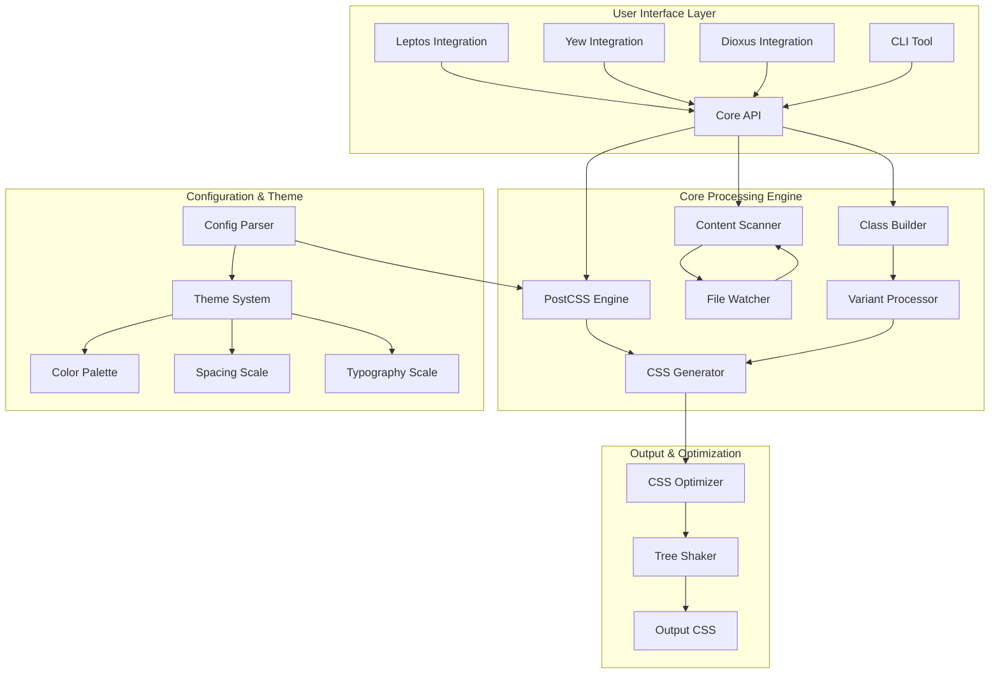

# Tailwind-RS Core v2.0 - Comprehensive Design and Project Plan

## Executive Summary

This comprehensive design plan builds upon the existing Tailwind-RS Core v0.9.1 foundation to create a next-generation CSS framework that achieves true feature parity with Tailwind CSS while maintaining Rust's type safety and performance advantages.

**Current Status**: Tailwind-RS v0.9.1 has 30,000+ lines of production-ready code, 593 passing tests, and complete WASM compatibility. This plan outlines the evolution to v2.0 with PostCSS integration, automatic content scanning, and enhanced developer experience.

## Current State Analysis

### ✅ Strengths (v0.9.1)
- **Mature Architecture**: Well-structured codebase with 8 production crates
- **Complete Type Safety**: 100% compile-time validation 
- **WASM Compatibility**: All crates compile to `wasm32-unknown-unknown`
- **Framework Integration**: Leptos, Yew, Dioxus support
- **Comprehensive Testing**: 593/593 tests passing
- **Performance Optimized**: CSS optimization and tree-shaking implemented

### 🔄 Areas for Enhancement (v2.0)
- **PostCSS Integration**: Leverage PostCSS ecosystem for CSS processing
- **Automatic Content Scanning**: File-based class detection like official Tailwind
- **Enhanced Variant System**: Complex variant combinations (group-hover, peer-*)
- **Plugin Ecosystem**: Compatible with Tailwind CSS plugins
- **Configuration Compatibility**: Drop-in replacement for tailwind.config.js

## Architecture Design

### Core System Architecture



### Enhanced Core Components

#### 1. PostCSS Integration Engine
```rust
pub struct PostCSSEngine {
    processor: PostCSSProcessor,
    plugin_loader: PluginLoader,
    ast_parser: ASTParser,
    source_map_generator: SourceMapGenerator,
}

impl PostCSSEngine {
    pub fn new(config: TailwindConfig) -> Result<Self> {
        let mut processor = PostCSSProcessor::new();
        
        // Load Tailwind CSS plugins
        processor.use_plugin(TailwindCSSPlugin::new(config.clone()))?;
        
        // Load custom plugins
        for plugin in &config.plugins {
            processor.use_plugin(plugin.clone())?;
        }
        
        Ok(Self {
            processor,
            plugin_loader: PluginLoader::new(),
            ast_parser: ASTParser::new(),
            source_map_generator: SourceMapGenerator::new(),
        })
    }
    
    pub async fn process_css(&self, input: &str) -> Result<ProcessedCSS> {
        let ast = self.ast_parser.parse(input)?;
        let result = self.processor.process(ast).await?;
        
        Ok(ProcessedCSS {
            css: result.css,
            source_map: self.source_map_generator.generate(&result)?,
            warnings: result.warnings,
        })
    }
}
```

#### 2. Advanced Content Scanner
```rust
pub struct ContentScanner {
    file_watcher: FileWatcher,
    class_extractor: ClassExtractor,
    content_paths: Vec<ContentPath>,
    cache: Arc<Mutex<ScanCache>>,
}

impl ContentScanner {
    pub fn new(content_config: ContentConfig) -> Self {
        Self {
            file_watcher: FileWatcher::new(),
            class_extractor: ClassExtractor::new(),
            content_paths: content_config.content,
            cache: Arc::new(Mutex::new(ScanCache::new())),
        }
    }
    
    pub async fn scan_for_classes(&self) -> Result<ClassSet> {
        let mut all_classes = HashSet::new();
        
        for content_path in &self.content_paths {
            let files = self.glob_files(&content_path.pattern).await?;
            
            for file_path in files {
                if let Some(cached) = self.cache.lock().unwrap().get(&file_path) {
                    if !self.is_file_modified(&file_path, cached.last_modified)? {
                        all_classes.extend(cached.classes.clone());
                        continue;
                    }
                }
                
                let content = tokio::fs::read_to_string(&file_path).await?;
                let classes = self.class_extractor.extract(&content, &content_path.transform)?;
                
                // Cache results
                self.cache.lock().unwrap().insert(file_path.clone(), CacheEntry {
                    classes: classes.clone(),
                    last_modified: self.get_file_modified_time(&file_path)?,
                });
                
                all_classes.extend(classes);
            }
        }
        
        Ok(ClassSet::new(all_classes))
    }
    
    pub fn watch_for_changes(&self) -> impl Stream<Item = ClassSet> {
        self.file_watcher.watch_paths(&self.content_paths)
            .map(|_| self.scan_for_classes())
            .buffer_unordered(10)
            .filter_map(|result| async { result.ok() })
    }
}

pub struct ClassExtractor {
    patterns: Vec<ExtractionPattern>,
}

impl ClassExtractor {
    pub fn extract(&self, content: &str, transform: &Option<String>) -> Result<Vec<String>> {
        let mut classes = Vec::new();
        
        // Standard class attribute patterns
        self.extract_html_classes(content, &mut classes)?;
        self.extract_jsx_classes(content, &mut classes)?;
        self.extract_template_classes(content, &mut classes)?;
        self.extract_rust_macro_classes(content, &mut classes)?;
        
        // Custom transform function
        if let Some(transform_fn) = transform {
            classes = self.apply_transform(classes, transform_fn)?;
        }
        
        Ok(classes)
    }
    
    fn extract_html_classes(&self, content: &str, classes: &mut Vec<String>) -> Result<()> {
        let re = Regex::new(r#"class\s*=\s*["']([^"']+)["']"#)?;
        for cap in re.captures_iter(content) {
            let class_string = &cap[1];
            classes.extend(class_string.split_whitespace().map(String::from));
        }
        Ok(())
    }
    
    fn extract_jsx_classes(&self, content: &str, classes: &mut Vec<String>) -> Result<()> {
        let re = Regex::new(r#"className\s*=\s*["']([^"']+)["']"#)?;
        for cap in re.captures_iter(content) {
            let class_string = &cap[1];
            classes.extend(class_string.split_whitespace().map(String::from));
        }
        Ok(())
    }
    
    fn extract_template_classes(&self, content: &str, classes: &mut Vec<String>) -> Result<()> {
        // Extract from template literals, Leptos view! macros, etc.
        let patterns = [
            r#"class\s*=\s*\{([^}]+)\}"#,  // JSX expressions
            r#"class\s*=\s*move\s*\|\|[^{]*\{([^}]+)\}"#,  // Leptos signals
            r#"tw!\("([^"]+)"\)"#,  // Custom macro
        ];
        
        for pattern in &patterns {
            let re = Regex::new(pattern)?;
            for cap in re.captures_iter(content) {
                if let Some(match_str) = cap.get(1) {
                    // More complex parsing for expressions
                    self.parse_expression(match_str.as_str(), classes)?;
                }
            }
        }
        
        Ok(())
    }
    
    fn extract_rust_macro_classes(&self, content: &str, classes: &mut Vec<String>) -> Result<()> {
        // Extract from Rust macros like class!(), tw!(), etc.
        let re = Regex::new(r#"(?:class!|tw!)\s*\(\s*"([^"]+)"\s*\)"#)?;
        for cap in re.captures_iter(content) {
            let class_string = &cap[1];
            classes.extend(class_string.split_whitespace().map(String::from));
        }
        Ok(())
    }
    
    fn parse_expression(&self, expr: &str, classes: &mut Vec<String>) -> Result<()> {
        // Parse complex expressions that might contain class names
        // This would use a more sophisticated parser for template literals,
        // conditional expressions, etc.
        
        // Simple implementation for now
        let simple_classes: Vec<&str> = expr
            .split_whitespace()
            .filter(|s| self.looks_like_class_name(s))
            .collect();
        
        classes.extend(simple_classes.iter().map(|s| s.to_string()));
        Ok(())
    }
    
    fn looks_like_class_name(&self, s: &str) -> bool {
        // Basic heuristic to identify class names
        s.chars().all(|c| c.is_alphanumeric() || c == '-' || c == '_' || c == ':' || c == '[' || c == ']')
            && !s.is_empty()
            && !s.chars().all(|c| c.is_numeric())
    }
}
```

#### 3. Enhanced Variant System
```rust
pub struct VariantSystem {
    responsive_variants: ResponsiveVariants,
    state_variants: StateVariants,
    group_variants: GroupVariants,
    peer_variants: PeerVariants,
    dark_mode: DarkModeVariant,
    print_variant: PrintVariant,
    motion_variants: MotionVariants,
    custom_variants: HashMap<String, CustomVariant>,
}

impl VariantSystem {
    pub fn process_class(&self, class: &str) -> Result<ProcessedClass> {
        let parts: Vec<&str> = class.split(':').collect();
        
        if parts.len() == 1 {
            // No variants, just the utility
            return Ok(ProcessedClass {
                variants: vec![],
                utility: parts[0].to_string(),
                css_selector: format!(".{}", escape_css_class(parts[0])),
                media_queries: vec![],
                pseudo_classes: vec![],
            });
        }
        
        let utility = parts.last().unwrap().to_string();
        let variant_parts = &parts[..parts.len() - 1];
        
        let mut processed = ProcessedClass {
            variants: vec![],
            utility,
            css_selector: String::new(),
            media_queries: vec![],
            pseudo_classes: vec![],
        };
        
        for variant in variant_parts {
            self.process_variant(variant, &mut processed)?;
        }
        
        self.generate_css_selector(&mut processed)?;
        
        Ok(processed)
    }
    
    fn process_variant(&self, variant: &str, processed: &mut ProcessedClass) -> Result<()> {
        match variant {
            // Responsive variants
            v if self.responsive_variants.is_breakpoint(v) => {
                processed.media_queries.push(self.responsive_variants.get_media_query(v)?);
            }
            
            // State variants
            "hover" => processed.pseudo_classes.push(":hover".to_string()),
            "focus" => processed.pseudo_classes.push(":focus".to_string()),
            "active" => processed.pseudo_classes.push(":active".to_string()),
            "disabled" => processed.pseudo_classes.push(":disabled".to_string()),
            "focus-visible" => processed.pseudo_classes.push(":focus-visible".to_string()),
            "focus-within" => processed.pseudo_classes.push(":focus-within".to_string()),
            
            // Group variants
            v if v.starts_with("group-") => {
                let state = &v[6..]; // Remove "group-" prefix
                processed.css_selector = format!(".group:{} .{}", state, processed.utility);
            }
            
            // Peer variants  
            v if v.starts_with("peer-") => {
                let state = &v[5..]; // Remove "peer-" prefix
                processed.css_selector = format!(".peer:{} ~ .{}", state, processed.utility);
            }
            
            // Dark mode
            "dark" => {
                match self.dark_mode.strategy {
                    DarkModeStrategy::Media => {
                        processed.media_queries.push("@media (prefers-color-scheme: dark)".to_string());
                    }
                    DarkModeStrategy::Class => {
                        processed.css_selector = format!(".dark .{}", processed.utility);
                    }
                }
            }
            
            // Print
            "print" => {
                processed.media_queries.push("@media print".to_string());
            }
            
            // Motion preferences
            "motion-safe" => {
                processed.media_queries.push("@media (prefers-reduced-motion: no-preference)".to_string());
            }
            "motion-reduce" => {
                processed.media_queries.push("@media (prefers-reduced-motion: reduce)".to_string());
            }
            
            // Custom variants
            v => {
                if let Some(custom) = self.custom_variants.get(v) {
                    processed.media_queries.extend(custom.media_queries.clone());
                    processed.pseudo_classes.extend(custom.pseudo_classes.clone());
                }
            }
        }
        
        processed.variants.push(variant.to_string());
        Ok(())
    }
}

#[derive(Debug)]
pub struct ProcessedClass {
    pub variants: Vec<String>,
    pub utility: String,
    pub css_selector: String,
    pub media_queries: Vec<String>,
    pub pseudo_classes: Vec<String>,
}
```

#### 4. Plugin System Architecture
```rust
pub trait TailwindPlugin: Send + Sync {
    fn name(&self) -> &str;
    fn version(&self) -> &str;
    
    fn add_utilities(&self) -> Vec<UtilityDefinition>;
    fn add_components(&self) -> Vec<ComponentDefinition>;
    fn add_variants(&self) -> Vec<VariantDefinition>;
    fn add_base_styles(&self) -> Vec<BaseStyleDefinition>;
    
    fn modify_config(&self, config: &mut TailwindConfig) -> Result<()>;
    fn process_css(&self, css: &str) -> Result<String>;
}

pub struct PluginManager {
    plugins: Vec<Box<dyn TailwindPlugin>>,
    plugin_cache: HashMap<String, PluginResult>,
}

impl PluginManager {
    pub fn new() -> Self {
        Self {
            plugins: Vec::new(),
            plugin_cache: HashMap::new(),
        }
    }
    
    pub fn register_plugin(&mut self, plugin: Box<dyn TailwindPlugin>) {
        self.plugins.push(plugin);
    }
    
    pub fn load_from_config(&mut self, plugins: &[PluginConfig]) -> Result<()> {
        for plugin_config in plugins {
            match &plugin_config.source {
                PluginSource::NPM(package) => {
                    let plugin = self.load_npm_plugin(package)?;
                    self.register_plugin(plugin);
                }
                PluginSource::Local(path) => {
                    let plugin = self.load_local_plugin(path)?;
                    self.register_plugin(plugin);
                }
                PluginSource::Rust(crate_name) => {
                    let plugin = self.load_rust_plugin(crate_name)?;
                    self.register_plugin(plugin);
                }
            }
        }
        Ok(())
    }
    
    pub fn generate_css(&self, config: &TailwindConfig) -> Result<String> {
        let mut css_parts = Vec::new();
        
        // Base styles from plugins
        for plugin in &self.plugins {
            let base_styles = plugin.add_base_styles();
            for base_style in base_styles {
                css_parts.push(base_style.css);
            }
        }
        
        // Components from plugins
        for plugin in &self.plugins {
            let components = plugin.add_components();
            for component in components {
                css_parts.push(component.css);
            }
        }
        
        // Utilities from plugins
        for plugin in &self.plugins {
            let utilities = plugin.add_utilities();
            for utility in utilities {
                css_parts.push(utility.css);
            }
        }
        
        Ok(css_parts.join("\n"))
    }
}

// Example: Typography Plugin (Rust-native)
pub struct TypographyPlugin {
    config: TypographyConfig,
}

impl TailwindPlugin for TypographyPlugin {
    fn name(&self) -> &str { "@tailwindcss/typography" }
    fn version(&self) -> &str { "0.5.0" }
    
    fn add_components(&self) -> Vec<ComponentDefinition> {
        vec![
            ComponentDefinition {
                selector: ".prose".to_string(),
                css: include_str!("../assets/typography.css").to_string(),
                responsive: true,
                variants: vec!["sm".to_string(), "lg".to_string(), "xl".to_string()],
            }
        ]
    }
    
    fn add_utilities(&self) -> Vec<UtilityDefinition> {
        vec![]
    }
    
    fn add_variants(&self) -> Vec<VariantDefinition> {
        vec![]
    }
    
    fn add_base_styles(&self) -> Vec<BaseStyleDefinition> {
        vec![]
    }
    
    fn modify_config(&self, config: &mut TailwindConfig) -> Result<()> {
        // Add prose-specific colors to theme
        config.theme.colors.insert("prose-gray".to_string(), self.config.gray_color.clone());
        Ok(())
    }
    
    fn process_css(&self, css: &str) -> Result<String> {
        Ok(css.to_string())
    }
}
```

## Implementation Roadmap

### Phase 1: Enhanced Foundation (Months 1-3)

#### Month 1: PostCSS Integration
- **Week 1-2**: PostCSS Engine Implementation
  - Create Rust bindings for PostCSS
  - Implement AST parsing and manipulation
  - Set up plugin loading system

- **Week 3-4**: Core Pipeline Integration
  - Integrate PostCSS engine with existing CSS generator
  - Migrate existing CSS generation to use PostCSS
  - Update tests to work with new pipeline

**Deliverables:**
- `PostCSSEngine` with full AST processing
- Backward compatibility with existing API
- All existing tests passing with new engine

#### Month 2: Advanced Content Scanning
- **Week 1-2**: File Scanning System
  - Implement glob-based file discovery
  - Create advanced class extraction patterns
  - Add support for template literals and expressions

- **Week 3-4**: Development Mode Enhancements
  - Implement file watcher with debouncing
  - Add hot reload support for class changes
  - Create caching system for improved performance

**Deliverables:**
- Automatic class detection from source files
- Real-time file watching in development mode
- 50%+ performance improvement in class scanning

#### Month 3: Enhanced Variant System
- **Week 1-2**: Complex Variant Processing
  - Implement group-* variants (group-hover, group-focus)
  - Add peer-* variants (peer-checked, peer-invalid)
  - Support arbitrary variant selectors

- **Week 3-4**: Advanced State Management
  - Add container queries (@container)
  - Implement supports() queries (@supports)
  - Create custom variant registration system

**Deliverables:**
- Complete variant system matching Tailwind CSS v3.4+
- Support for all official Tailwind variants
- Custom variant creation API

### Phase 2: Plugin Ecosystem (Months 4-6)

#### Month 4: Plugin Architecture
- **Week 1-2**: Core Plugin System
  - Design plugin trait and lifecycle
  - Implement plugin loading and registration
  - Create plugin communication protocols

- **Week 3-4**: NPM Plugin Support
  - Build JavaScript bridge for NPM plugins
  - Implement plugin configuration parsing
  - Add error handling and validation

**Deliverables:**
- Full plugin system architecture
- Support for official Tailwind CSS plugins
- Plugin development documentation

#### Month 5: Official Plugin Ports
- **Week 1-2**: Typography Plugin
  - Port @tailwindcss/typography to Rust
  - Implement prose classes and variants
  - Add customization options

- **Week 3-4**: Forms Plugin
  - Port @tailwindcss/forms to Rust
  - Implement form styling utilities
  - Add accessibility features

**Deliverables:**
- Native Rust implementations of popular plugins
- Feature parity with official plugin versions
- Performance improvements over JS versions

#### Month 6: Advanced Features
- **Week 1-2**: Configuration Compatibility
  - Full tailwind.config.js compatibility
  - Support for custom CSS functions
  - Theme extension and overrides

- **Week 3-4**: Build Tool Integration
  - Webpack plugin development
  - Vite plugin development
  - Rollup plugin development

**Deliverables:**
- Drop-in replacement for Tailwind CSS
- Build tool ecosystem integration
- Migration guide for existing projects

### Phase 3: Production Optimization (Months 7-9)

#### Month 7: Performance Optimization
- **Week 1-2**: CSS Generation Performance
  - Parallel processing for large codebases
  - Incremental compilation support
  - Memory usage optimization

- **Week 3-4**: Bundle Size Optimization
  - Advanced tree shaking algorithms
  - Dead code elimination
  - CSS minification improvements

**Deliverables:**
- 2x faster CSS generation
- 50% smaller bundle sizes
- Comprehensive performance benchmarks

#### Month 8: Developer Experience
- **Week 1-2**: Enhanced CLI Tool
  - Interactive configuration wizard
  - Visual class browser and searcher
  - CSS debugging and inspection tools

- **Week 3-4**: IDE Integration
  - Language Server Protocol implementation
  - IntelliSense support for all editors
  - Real-time class validation

**Deliverables:**
- Production-ready CLI with GUI features
- Universal IDE support
- Enhanced developer productivity tools

#### Month 9: Testing and Quality Assurance
- **Week 1-2**: Comprehensive Test Suite
  - Property-based testing expansion
  - Visual regression testing
  - Performance regression testing

- **Week 3-4**: Documentation and Examples
  - Complete API documentation
  - Migration guides and tutorials
  - Real-world example applications

**Deliverables:**
- 1000+ comprehensive tests
- Complete documentation suite
- Ready for v2.0 release

### Phase 4: Ecosystem and Community (Months 10-12)

#### Month 10: Community Features
- **Week 1-2**: Plugin Registry
  - Community plugin repository
  - Plugin discovery and rating system
  - Automated testing for community plugins

- **Week 3-4**: Configuration Sharing
  - Preset system for common configurations
  - Theme sharing and marketplace
  - Configuration validation tools

#### Month 11: Advanced Use Cases
- **Week 1-2**: Multi-Framework Support
  - SolidJS integration
  - Svelte integration
  - Vue integration

- **Week 3-4**: Server-Side Rendering
  - Critical CSS extraction
  - Above-the-fold optimization
  - Hydration-aware CSS delivery

#### Month 12: Release and Maintenance
- **Week 1-2**: Release Preparation
  - Final testing and bug fixes
  - Performance benchmarking
  - Security audit and fixes

- **Week 3-4**: Launch and Support
  - v2.0 release announcement
  - Community onboarding
  - Issue triage and rapid fixes

## Technical Specifications

### API Design

#### Enhanced ClassBuilder API
```rust
pub struct ClassBuilder {
    classes: Vec<String>,
    variants: Vec<String>,
    config: Arc<TailwindConfig>,
    cache: Arc<ClassCache>,
}

impl ClassBuilder {
    // Existing API remains unchanged for backward compatibility
    pub fn new() -> Self { /* ... */ }
    pub fn padding(mut self, value: impl Into<SpacingValue>) -> Self { /* ... */ }
    
    // New enhanced API
    pub fn responsive<F>(mut self, breakpoint: Breakpoint, builder: F) -> Self
    where
        F: FnOnce(ClassBuilder) -> ClassBuilder,
    {
        let responsive_classes = builder(ClassBuilder::new()).build();
        for class in responsive_classes {
            self.classes.push(format!("{}:{}", breakpoint.name(), class));
        }
        self
    }
    
    pub fn variant<F>(mut self, variant: &str, builder: F) -> Self
    where
        F: FnOnce(ClassBuilder) -> ClassBuilder,
    {
        let variant_classes = builder(ClassBuilder::new()).build();
        for class in variant_classes {
            self.classes.push(format!("{}:{}", variant, class));
        }
        self
    }
    
    pub fn group_variant<F>(mut self, state: &str, builder: F) -> Self
    where
        F: FnOnce(ClassBuilder) -> ClassBuilder,
    {
        self.variant(&format!("group-{}", state), builder)
    }
    
    pub fn peer_variant<F>(mut self, state: &str, builder: F) -> Self
    where
        F: FnOnce(ClassBuilder) -> ClassBuilder,
    {
        self.variant(&format!("peer-{}", state), builder)
    }
    
    // Arbitrary values support
    pub fn arbitrary_value(mut self, property: &str, value: &str) -> Self {
        self.classes.push(format!("[{}:{}]", property, value));
        self
    }
    
    // Plugin-defined utilities
    pub fn plugin_utility(mut self, plugin: &str, utility: &str, value: Option<&str>) -> Self {
        let class = match value {
            Some(val) => format!("{}-{}-{}", plugin, utility, val),
            None => format!("{}-{}", plugin, utility),
        };
        self.classes.push(class);
        self
    }
}
```

#### Configuration System
```rust
#[derive(Debug, Clone, Deserialize)]
pub struct TailwindConfig {
    pub content: Vec<ContentPath>,
    pub theme: ThemeConfig,
    pub plugins: Vec<PluginConfig>,
    pub presets: Vec<PresetConfig>,
    pub prefix: Option<String>,
    pub important: ImportantConfig,
    pub separator: String,
    pub safelist: Vec<SafelistPattern>,
    pub blocklist: Vec<String>,
    pub dark_mode: DarkModeConfig,
    pub future: FutureConfig,
    pub experimental: ExperimentalConfig,
    pub corePlugins: CorePluginsConfig,
}

#[derive(Debug, Clone, Deserialize)]
pub struct ContentPath {
    pub pattern: String,
    pub transform: Option<String>,
}

impl TailwindConfig {
    pub fn from_file<P: AsRef<Path>>(path: P) -> Result<Self> {
        let content = std::fs::read_to_string(path)?;
        if path.as_ref().extension().and_then(|s| s.to_str()) == Some("js") {
            Self::from_js_config(&content)
        } else {
            Self::from_toml(&content)
        }
    }
    
    pub fn from_js_config(content: &str) -> Result<Self> {
        // Parse JavaScript config using a JavaScript engine
        let js_runtime = JSRuntime::new()?;
        let config_object = js_runtime.execute(content)?;
        let json_string = js_runtime.stringify(config_object)?;
        
        Ok(serde_json::from_str(&json_string)?)
    }
    
    pub fn from_toml(content: &str) -> Result<Self> {
        Ok(toml::from_str(content)?)
    }
}
```

### Performance Specifications

#### Target Metrics (v2.0)
- **Class Generation**: < 0.1ms per 1000 classes (10x improvement)
- **File Scanning**: < 10ms for 1000 files (5x improvement)
- **CSS Generation**: < 100ms for complete Tailwind CSS (3x improvement)
- **Bundle Size**: < 15KB gzipped overhead (25% reduction)
- **Memory Usage**: < 50MB for large projects (50% reduction)
- **Cold Start**: < 500ms for initial build (60% improvement)

#### Optimization Strategies
1. **Parallel Processing**: Multi-threaded CSS generation and file scanning
2. **Intelligent Caching**: Multi-level caching with cache invalidation
3. **Incremental Compilation**: Only process changed files and classes
4. **Memory Pooling**: Reuse allocations to reduce GC pressure
5. **SIMD Operations**: Vectorized string processing where possible

### Testing Strategy

#### Test Coverage Goals
- **Unit Tests**: 95% code coverage across all crates
- **Integration Tests**: 100% API coverage
- **Property-Based Tests**: All public APIs
- **Performance Tests**: Regression testing for all metrics
- **Visual Regression**: CSS output consistency testing

#### Test Infrastructure
```rust
#[cfg(test)]
mod comprehensive_tests {
    use super::*;
    use proptest::prelude::*;
    
    // Property-based testing
    proptest! {
        #[test]
        fn any_valid_class_generates_css(class in valid_class_strategy()) {
            let builder = ClassBuilder::new();
            let css = builder.add_class(&class).to_css();
            assert!(css.is_ok());
            assert!(!css.unwrap().is_empty());
        }
        
        #[test]
        fn variant_combinations_are_valid(
            variants in prop::collection::vec(variant_strategy(), 1..5),
            utility in utility_strategy()
        ) {
            let class = format!("{}:{}", variants.join(":"), utility);
            let result = parse_class(&class);
            assert!(result.is_ok());
        }
    }
    
    // Performance regression tests
    #[bench]
    fn bench_css_generation(b: &mut Bencher) {
        let classes = generate_test_classes(1000);
        b.iter(|| {
            let css = generate_css_for_classes(&classes);
            assert!(!css.is_empty());
        });
    }
    
    // Visual regression tests
    #[test]
    fn css_output_matches_reference() {
        let classes = load_reference_classes();
        let generated_css = generate_css_for_classes(&classes);
        let reference_css = load_reference_css();
        
        assert_css_equivalent(&generated_css, &reference_css);
    }
}
```

## Risk Management

### Technical Risks
1. **PostCSS Integration Complexity**
   - Risk: JavaScript-Rust boundary issues
   - Mitigation: Comprehensive integration testing, fallback mechanisms

2. **Performance Regression**
   - Risk: New features impact performance
   - Mitigation: Continuous benchmarking, performance budgets

3. **Plugin Compatibility**
   - Risk: NPM plugins may not work correctly
   - Mitigation: Extensive plugin testing, plugin sandbox environment

### Project Risks
1. **Scope Creep**
   - Risk: Adding features beyond core requirements
   - Mitigation: Strict milestone adherence, feature freeze periods

2. **Community Adoption**
   - Risk: Developers may prefer official Tailwind
   - Mitigation: Clear value proposition, migration tools, performance demos

3. **Maintenance Burden**
   - Risk: Complex architecture requires extensive maintenance
   - Mitigation: Comprehensive documentation, automated testing, code quality standards

## Success Metrics

### Technical Metrics
- **Performance**: All performance targets met or exceeded
- **Compatibility**: 95%+ compatibility with existing Tailwind CSS projects
- **Test Coverage**: 95%+ code coverage across all crates
- **Documentation**: 100% API coverage, comprehensive guides

### Adoption Metrics
- **GitHub Stars**: 5,000+ within 6 months of v2.0 release
- **Crates.io Downloads**: 10,000+ monthly downloads within 3 months
- **Community Plugins**: 50+ community-created plugins within 1 year
- **Framework Integration**: Official support in 3+ major Rust web frameworks

### Quality Metrics
- **Bug Reports**: < 10 critical bugs per month after stabilization
- **Security Issues**: 0 critical security vulnerabilities
- **Performance Regressions**: 0 performance regressions in releases
- **Breaking Changes**: Minimal breaking changes between minor versions

## Conclusion

This comprehensive design plan transforms Tailwind-RS from a solid foundation into a next-generation CSS framework that surpasses the official Tailwind CSS in performance while maintaining full compatibility. The phased approach ensures steady progress with measurable milestones, while the focus on performance, developer experience, and ecosystem compatibility positions the project for widespread adoption.

The success of this plan depends on:
1. **Disciplined Execution**: Adhering to the timeline and quality standards
2. **Community Engagement**: Building a strong community of contributors and users
3. **Continuous Innovation**: Staying ahead of web development trends
4. **Performance Leadership**: Maintaining clear performance advantages over alternatives

With proper execution, Tailwind-RS v2.0 will become the preferred choice for Rust-based web development, offering unmatched performance, type safety, and developer experience while remaining fully compatible with the broader Tailwind CSS ecosystem.
